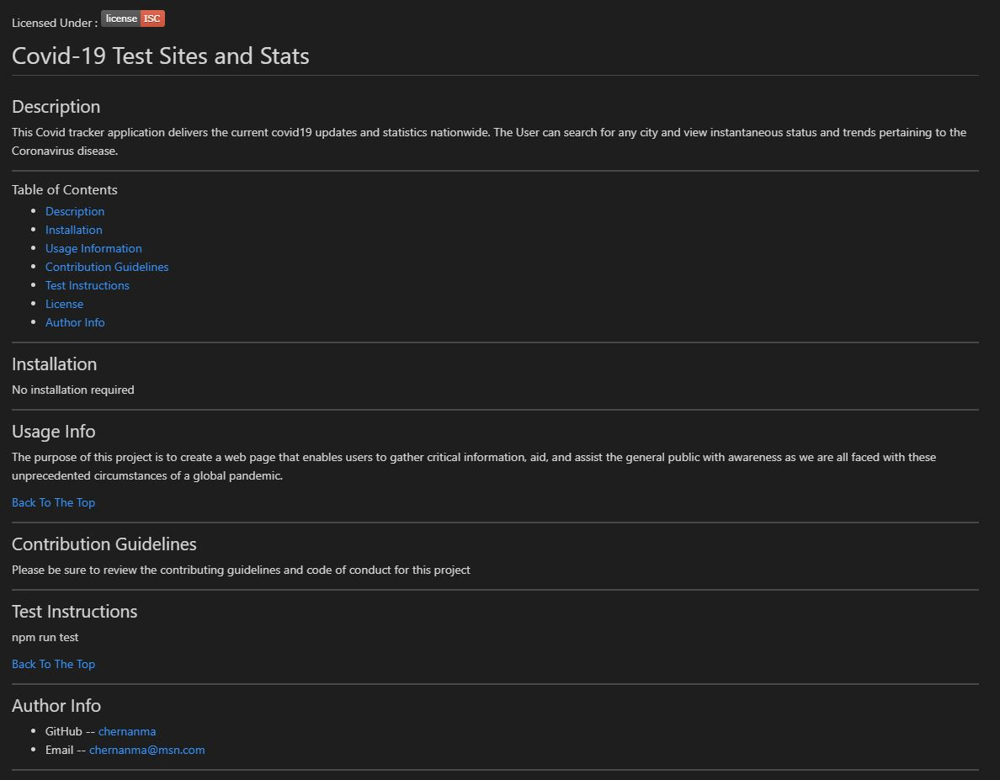

# Professional README Generator - Node.js

This project dynamically generates professional README files base on the user's project information. The application has been written using Node.js and allows any project creator to easily generate a professional README just using the command-line.


[Click here to go to the Readme Generator Repository](https://github.com/chernanma/Readme-Generator)


---
## How it works


[Click here to watch video](https://chernanma.github.io/Readme-Generator/video.html)

---

## Acceptance Criteria 

Below is the acceptance criteria used to develop this project.

```md
GIVEN a command-line application that accepts user input
WHEN I am prompted for information about my application repository
THEN a high-quality, professional README.md is generated with the title of my project and sections entitled Description, Table of Contents, Installation, Usage, License, Contributing, Tests, and Questions
WHEN I enter my project title
THEN this is displayed as the title of the README
WHEN I enter a description, installation instructions, usage information, contribution guidelines, and test instructions
THEN this information is added to the sections of the README entitled Description, Installation, Usage, Contributing, and Tests
WHEN I choose a license for my application from a list of options
THEN a badge for that license is added near the top of the README and a notice is added to the section of the README entitled License that explains which license the application is covered under
WHEN I enter my GitHub username
THEN this is added to the section of the README entitled Questions, with a link to my GitHub profile
WHEN I enter my email address
THEN this is added to the section of the README entitled Questions, with instructions on how to reach me with additional questions
WHEN I click on the links in the Table of Contents
THEN I am taken to the corresponding section of the README
```

---

## Code 

``` JS
/**** index.js******/

const fs = require("fs");
const inquirer = require("inquirer");

const questions= [
        {
            type: "input",
            name: "author",
            message: "Please enter you full name"
        },    
        {
            type: "input",
            name: "title",
            message: "What is your project's title?"
          },
          {
            type: "input",
            name: "description",
            message: "Please enter a project's description"
          },
          {
            type: "input",
            name: "installation",
            message: "Please enter installation instruction if any"            
          },
          {
            type: "input",
            name: "usageinfo",
            message: "What does the user need to know about this Readme-Generator?",
          },
          {
            type: "input",
            name: "contribution",
            message: "What does the user need to know about contributing to help your project contributors do a good work ?",
          },
          {
            type: "input",
            name: "test",
            message: "What command should be run to run tests?"            
          },
          { 
            type: "list",
            name: "license",
            message: "What kind of license should your project have?",
            choices: ["ISC","MIT","EPL 201.0", "APACHE 2.0", "GPL 3.0","LGPL 20v3", "BSD 3", "None"]
          },
          {
            type: "input",
            name: "github",
            message: "What is your GitHub username?"
          },
          {
            type: "input",
            name: "email",
            message: "What is your Email address?"
          }

    ];

// function to write README file
function writeToFile(fileName, data) {
    return fs.writeFileSync(fileName,data);
}

// Generate Readme object based on User input
function generateReadme (data){
const readmeInfo = `
Licensed Under :  }-red.svg)

# ${data.title}

## Description

${data.description}

---

### Table of Contents
- [Description](#description)
- [Installation](#installation)
- [Usage Information](#usage-info)
- [Contribution Guidelines](#contribution-guidelines)
- [Test Instructions](#test-instructions)
- [License](#License)
- [Author Info](#author-info)
---
    
## Installation

${data.installation}

---

## Usage Info

${data.usageinfo}

[Back To The Top](#description)

---

## Contribution Guidelines

${data.contribution}

---

## Test Instructions

${data.test}

[Back To The Top](#description)

---     
## Author Info

- GitHub -- [${data.github}](https://github.com/${data.github})
- Email -- [${data.email}](mailto:${data.email})
---

## License
Copyright (c) ${data.author}

This project is covered under the following license

}-red.svg)   

[Back To The Top](#description)
`;
return readmeInfo;
}

// function to initialize program
function init() {
    inquirer.prompt(questions)
        .then (function(response){              
            generateReadme (response);
            console.log(generateReadme(response));
            writeToFile("README.md",generateReadme(response));
        })
        .catch(function(err){
            console.log(err);
        })
}

// function call to initialize program
init();

```

## Technologies

- Node.js

### Packages

-  Inquirer.js 

---

## Screenshots

### README Generated




---
## References

- The Node.js fs module, https://nodejs.dev/learn/the-nodejs-fs-module

- npm - Inquirer.js, https://www.npmjs.com/package/inquirer#methods

- Professional README Generator, John Hopkins University Boot Camp

